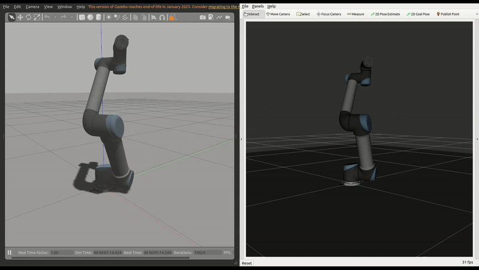
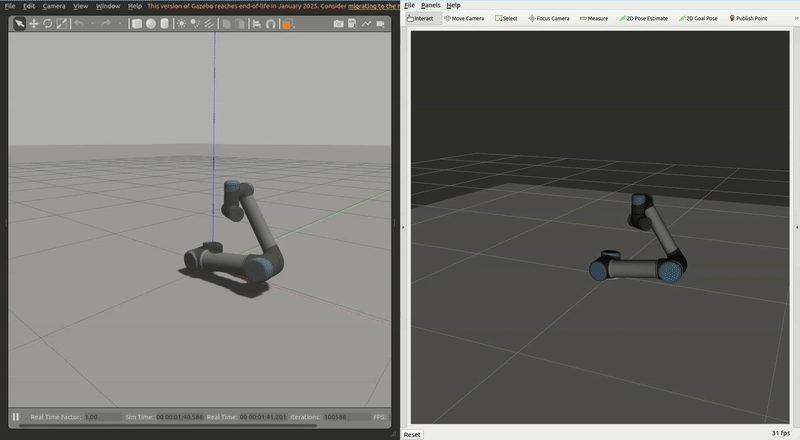

# ROS 2 NR Motion Control

A modular ROS 2 package designed for motion planning and control of a **UR5 robotic arm**, supporting **joint-space**, **Cartesian-space**, and **sinusoidal trajectory** generation. Compatible with Gazebo simulation and RViz visualization tools.

---

## 📚 Table of Contents

- [Overview](#overview)
- [Package Structure](#package-structure)
- [Prerequisites](#prerequisites)
- [Installation](#installation)
- [Usage](#usage)
  - [Sinusoidal Joint Motion](#sinusoidal-joint-motion)
  - [Joint-Space Trajectory](#joint-space-trajectory)
  - [Cartesian-Space Trajectory](#cartesian-space-trajectory)
- [Running Unit Tests](#running-unit-tests)

---

## Overview

This repository provides a ROS 2 control interface for manipulating a UR5 robotic arm, including:

- **Sinusoidal joint motion** for dynamic demonstrations
- **Joint-space trajectory control** between predefined configurations
- **Cartesian-space trajectory planning** using KDL kinematics

---

## Package Structure

```bash
.
├── ros2_nr_motion_control                # Main control package
│   ├── CMakeLists.txt
│   ├── package.xml
│   ├── LICENSE
│   ├── include/
│   │   └── robot_arm_motion_planner/
│   │       └── robot_arm_motion_planner.hpp
│   ├── src/
│   │   ├── cartesian_space_trajectory_node.cpp
│   │   ├── joint_angle_publisher.cpp
│   │   ├── joint_sine_publisher.cpp
│   │   └── joint_space_trajectory_node.cpp
│   ├── launch/
│   │   ├── cartesian_space_trajectory.launch.py
│   │   ├── joint_space_trajectory.launch.py
│   │   └── sinusoidal_trajectory.launch.py
│   ├── test/
│   │   └── test_robot_arm_motion_planner.cpp
│   └── rviz/
│       └── view_robot.rviz
└── Universal_Robots_ROS2_Gazebo_Simulation   # Simulation submodule
```

---

## Prerequisites

- **Ubuntu 22.04**
- **ROS 2 Humble**
- **Classic Gazebo (not Ignition)**
- **KDL (Kinematics and Dynamics Library)**

---

## Installation

Clone the repository **recursively** to include the simulation submodule:

```bash
git clone --recurse-submodules git@github.com:robotcopper/ros2_NR_manipulation_challenge.git
```

Then, build the workspace with `colcon`:

```bash
cd ros2_NR_manipulation_challenge
colcon build --symlink-install
source install/setup.bash
```

---

## Usage

### Sinusoidal Joint Motion

Generates a sinusoidal trajectory across all joints of the UR5 arm:

- **Frequency**: `0.2 Hz`  
- **Amplitude**: `-0.5 radians`  
- **Offset**: `-π / 2`

> [!NOTE]  
>These settings can be changed in 
>```bash
>ros2_nr_motion_control
>└── src/
>    └── joint_sine_publisher.cpp
>```

```bash
ros2 launch ros2_nr_motion_control sinusoidal_trajectory.launch.py
```
<p align="center">
    
</p>


### Joint-Space Trajectory

Executes a smooth trajectory between two joint configurations:

- **Point1**: `{3.0, -1.0, 0.0, -1.0, 1.0, 0.0}`  
- **Point2**: `{3.14, -3.0, 2.0, 1.0, -1.0, 3.0}`  
- **Joint Velocity**: `1.0`  
- **Joint Acceleration**: `1.0`

> [!NOTE]  
>These settings can be changed in 
>```bash
>ros2_nr_motion_control
>└── src/
>    └── joint_space_trajectory_node.cpp
>```

```bash
ros2 launch ros2_nr_motion_control joint_space_trajectory.launch.py
```
<p align="center">
    
</p>


### Cartesian-Space Trajectory

Plans a trajectory in Cartesian space using inverse kinematics:

- **Pose1**: `(0.5, 0.5, 0.25, 0.0, π / 3, 0.0)` *(xyzrpy)*  
- **Pose2**: `(-0.25, 0.25, 0.75, 0.0, -π / 2, 0.0)` *(xyzrpy)* 
- **Linear Velocity**: `0.2`  
- **Linear Acceleration**: `0.1`

> [!NOTE]  
>These settings can be changed in 
>```bash
>ros2_nr_motion_control
>└── src/
>    └── cartesian_space_trajectory_node.cpp
>```

```bash
ros2 launch ros2_nr_motion_control cartesian_space_trajectory.launch.py
```
<p align="center">
    
</p>

> [!IMPORTANT]  
> The inverse kinematics solution in the Cartesian motion does not take into account the case where the trajectory goes outside the robot's workspace. Ensure that the movement points are consistent with the robot's workspace.

> [!NOTE]  
> The display of motion in joint space and motion in Cartesian space is looped (the beginning becomes the end when a trajectory is executed) for better visualization of motion between the two points only.

---

## Running Unit Tests

Unit tests are available for the core trajectory planning library `robot_arm_motion_planner`. To run the tests:

```bash
colcon test --packages-select ros2_nr_motion_control --event-handlers console_direct+
```

This will execute the test suite located in:

```bash
ros2_nr_motion_control
└── test/
    └── test_robot_arm_motion_planner.cpp
```

Make sure the workspace has been built beforehand. The output will be displayed directly in the console.